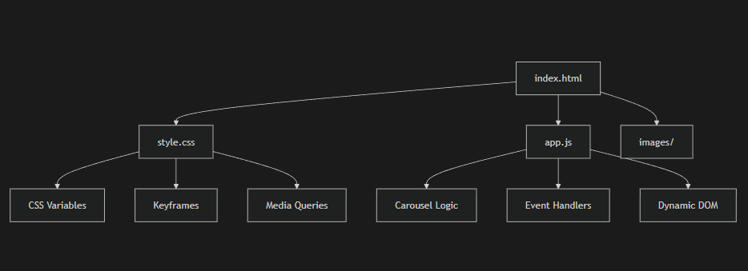
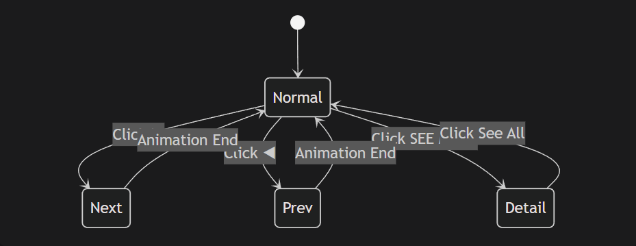

🎧 Product Carousel with Detail View
<div align="center">


🚀 A Sleek, Interactive 3D Carousel Experience

• ✨ Live Demo

• 📦 Installation

• 🛠️ Customization

• 📱 Responsive

</div>
<br>
📋 Table of Contents

✨ Features

🎯 Demo Preview

⚡ Installation

🏗️ Project Structure

🎨 Customization

📱 Responsive Design

🧠 How It Works

🔄 Browser Support

<br>

✨ Features
<div align="center">
Feature	Description

🎠	3D Carousel	Smooth transform animations with depth effect

🔍	Detail View	Expandable product specifications

📱	Responsive	Perfect on desktop, tablet, and mobile

⚡	Performance	60fps animations with CSS transforms

🎨	Customizable	CSS variables for easy theming

♿	Accessible	Keyboard navigation ready

🎭	Animated	Staggered fade-in effects
</div>
<br>
🎯 Demo Preview

<div align="center">
🖥️ Desktop View

```
text
┌─────────────────────────────────────────────────────────┐
│  ┌─────┐  ┌────────────────────────────────────────┐   │
│  │LOGO │  │  Home  Info  Contact                   │   │
│  └─────┘  └────────────────────────────────────────┘   │
├─────────────────────────────────────────────────────────┤
│                                                         │
│           ╭─────────────────────────────────╮          │
│    ◀      │     DESIGN SLIDER              │      ▶    │
│           │     EARPHONE                   │          │
│           │     Lorem ipsum...             │          │
│           │     ┌────────────┐             │          │
│           │     │ SEE MORE   │             │          │
│           │     └────────────┘             │          │
│           ╰─────────────────────────────────╯          │
│                                                         │
│                      ╔═══════════╗                     │
│                      ║ See All   ║                     │
│                      ╚═══════════╝                     │
└─────────────────────────────────────────────────────────┘
```
</div>
<br>

⚡ Installation

Clone Repository

```
bash
# Clone the repository
git clone https://github.com/anas-24-dev/Carousel_website.git

# Navigate to project
cd Carousel_website
```

🏗️ Project Structure

<br>
<br>
🎨 Customization
<br>
<br>

🎭 CSS Variables

Edit :root in style.css to customize the carousel behavior:

css ->
```
:root {
    /* Position 1 - Hidden Left */
    --item1-transform: translateX(-100%) translateY(-5%) scale(1.5);
    --item1-filter: blur(30px);
    
    /* Position 2 - Active Center */
    --item2-transform: translateX(0);
    --item2-filter: blur(0px);
    
    /* Position 3 - Right Side */
    --item3-transform: translate(50%,10%) scale(0.8);
    --item3-filter: blur(10px);
    
    /* Position 4 - Far Right */
    --item4-transform: translate(90%,20%) scale(0.5);
    --item4-filter: blur(30px);
    
    /* Position 5 - Hidden Right */
    --item5-transform: translate(120%,30%) scale(0.3);
    --item5-filter: blur(40px);
}

<br>
🎯 Animation Timing
```
css<br>
/* Adjust animation speeds */
```
.carousel.next .item:nth-child(1) { 
    animation: transformFromPosition2 0.5s ease-in-out; 
}
.carousel.next .item:nth-child(2) { 
    animation: transformFromPosition3 0.7s ease-in-out; 
}
.carousel.next .item:nth-child(3) { 
    animation: transformFromPosition4 0.9s ease-in-out; 
}
.carousel.next .item:nth-child(4) { 
    animation: transformFromPosition5 1.1s ease-in-out; 
}
```
🎨 Color Scheme<br>
css
<br>
/* Update gradient background */
```
.carousel::before {
    background-image: linear-gradient(70deg, #DC422A, blue);
    /* Change to your brand colors */
}
```
/* Update button colors */
```
.carousel.showDetail .list .item:nth-child(2) .checkout button:nth-child(2) {

    background-color: #693EFF; /* Your brand color */
}
```


📱 Responsive Design

<div align="start">
Device	Breakpoint	Optimizations:

📱 Mobile	< 767px	Compact layout, scrollable specs

📟 Tablet	768px - 991px	Optimized spacing, fluid typography

💻 Desktop	> 992px	Full experience with 3D effects
</div>

Mobile View Example
<br>
css
<br>
@media screen and (max-width: 767px) {

    .carousel {
        height: 600px; /* Compact height */
    }
    .carousel .list .item:nth-child(2) .introduce {

        width: 50%; /* Half-width content */
    }
    .carousel.showDetail .list .item:nth-child(2) .detail {

        backdrop-filter: blur(10px); /* Glass morphism effect */
    }
}
🧠 How It Works
🎪 Carousel Algorithm
javascript
// The magic behind the scenes:

const showSlider = (type) => {

    // 1. Disable buttons (prevent spam)
    // 2. Remove animation classes
    // 3. Reorder DOM elements
    // 4. Trigger CSS animations
    // 5. Re-enable buttons after 2 seconds

}

🎭 State Management


🔄 Browser Support
<div align="center">
✅
✅
✅
✅
</div>
<br>

🚀 Performance
```
json
{
  "performance": {
    "firstPaint": "~0.3s",
    "interactive": "~0.5s",
    "animations": "60fps",
    "cssTransforms": true,
    "gpuAccelerated": true
  }
}
```
<br>
</div>